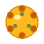
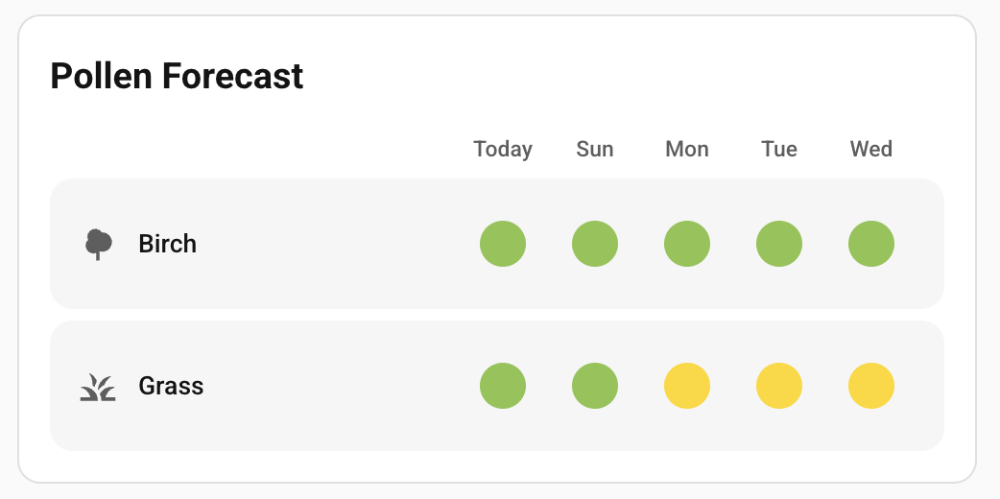
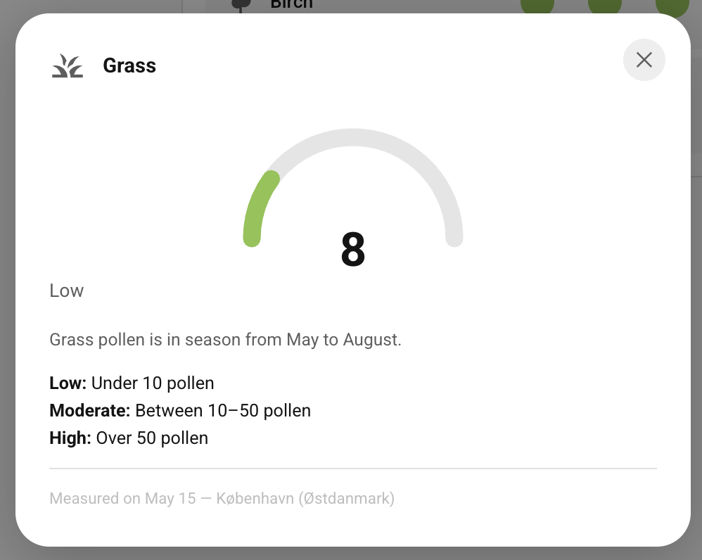

#  Pollen DK - Home Assistant Integration

Home Assistant custom integration that fetches **live pollen data** for Denmark from **Astma-Allergi Danmarks** official JSON feed.

> **Data source:** `https://www.astma-allergi.dk/umbraco/Api/PollenApi/GetPollenFeed`
> This is the same backend used by Astma-Allergi Danmarks own app and website — not a scraper.

> **Disclaimer:** This integration is an independent community project and is not affiliated with, endorsed by, or in any way connected to Astma-Allergi Danmark.

> **Requires Home Assistant 2026.6.0 or newer.**

---

## Features

- **No scraping** — uses the official JSON API endpoint
- **Two measurement stations**: København (Østdanmark) and Viborg (Vestdanmark)
- **8 pollen/spore types**: Birk, Bynke, El, Elm, Græs, Hassel, Alternaria, Cladosporium
- **Raw count sensors** (pollen/m³) with severity attribute for each type
- **Overall severity sensor** per region (worst level across all types)
- **5-day forecast** — per-allergen daily counts and worst-severity summary per day
- **Custom Lovelace card** — visual forecast grid with severity dots and detail popup
- UI config flow — no YAML required
- Updates every hour (data itself refreshes once daily ~16:00 CET)

---

## Sensors created

For each configured region you get:

| Entity | Description |
|---|---|
| `sensor.pollen_dk_birk_REGION` | Birch pollen count (pollen/m³) |
| `sensor.pollen_dk_bynke_REGION` | Mugwort pollen count |
| `sensor.pollen_dk_el_REGION` | Alder pollen count |
| `sensor.pollen_dk_elm_REGION` | Elm pollen count |
| `sensor.pollen_dk_graes_REGION` | Grass pollen count |
| `sensor.pollen_dk_hassel_REGION` | Hazel pollen count |
| `sensor.pollen_dk_alternaria_REGION` | Alternaria mold spore count |
| `sensor.pollen_dk_cladosporium_REGION` | Cladosporium mold spore count |
| `sensor.pollen_dk_pollenvarsel_REGION` | Overall worst severity level |

Each count sensor includes the following **attributes**:
- `severity` — `none` / `low` / `moderate` / `high` / `very_high` / `unknown`
- `pollen_type_da` — Danish name
- `pollen_type_en` — English name
- `last_update` — Date of last measurement
- `region` — Station name
- `forecast` — dict of upcoming dates → predicted pollen count (e.g. `{"28-04-2026": 2, "29-04-2026": 5, ...}`). Out-of-season types have an empty dict.

The **overall severity sensor** includes:
- `pollen_levels` — dict of all in-season types with count + severity
- `forecast` — dict of upcoming dates → worst severity across all allergens (e.g. `{"28-04-2026": "low", "29-04-2026": "moderate", ...}`)
- `last_update`

---

## Lovelace card

The integration ships a custom Lovelace card, `custom:pollen-dk-card`, that is automatically registered when the integration loads — no manual resource configuration needed.

| Card | Detail popup |
|---|---|
|  |  |

### Adding the card

In the Lovelace dashboard editor, click **Add card**, scroll to **Pollen DK**, and pick a region. The card is fully configurable from the visual editor — no YAML required.

Minimal YAML:

```yaml
type: custom:pollen-dk-card
region: koebenhavn
```

### Card options

| Option | Default | Description |
|---|---|---|
| `title` | *(translated)* | Card heading. Leave empty to use the language-aware default. |
| `region` | — | `koebenhavn` or `viborg` (required) |
| `days` | `5` | Number of days to show, including today (1–5) |
| `pollen_types` | *(all)* | Limit which pollen types are shown. Empty list = show all. |

### Card behaviour

- **Only in-season types are shown** — types with severity `none` or `unknown` are hidden automatically.
- **Responsive columns** — the number of day columns adjusts to the card width so dots never overflow.
- **Language-aware** — day labels, severity labels, pollen names and the card title follow the HA language setting. Danish and English are fully supported.
- **Severity dots** use a colour scale: <span style="color:#8BC34A">●</span> Low · <span style="color:#FFD600">●</span> Moderate · <span style="color:#FF9800">●</span> High · <span style="color:#F44336">●</span> Very high
- **Click any row** to open a detail popup with a severity gauge, threshold reference, and measurement date.

---

## Adding a language to the card

The card currently supports **Danish (`da`)** and **English (`en`)**. Any other HA language falls back to English automatically. Adding a new language requires a single edit to `custom_components/pollen_dk/www/pollen-dk-card.js`.

### Step 1 — add a translation entry

Inside the `TRANSLATIONS` constant, add a new key for the [BCP 47 language tag](https://www.iana.org/assignments/language-subtag-registry) that Home Assistant uses (e.g. `"de"` for German, `"nl"` for Dutch). Copy the `en` block and translate every string value. Functions that receive arguments must keep the same signature.

```js
const TRANSLATIONS = {
  da: { /* … */ },
  en: { /* … */ },

  de: {                                          // ← new language key
    default_title: "Pollenvorhersage",
    today: "Heute",
    weekdays: ["So", "Mo", "Di", "Mi", "Do", "Fr", "Sa"],
    severity: {
      none: "Keiner",
      low: "Niedrig",
      moderate: "Mäßig",
      high: "Hoch",
      very_high: "Sehr hoch",
      unknown: "Unbekannt",
    },
    no_data: (region) =>
      `Keine Pollendaten für ${region} gefunden.<br>Prüfen Sie die Integration.`,
    popup: {
      low: "Niedrig",
      moderate: "Mäßig",
      high: "Hoch",
      under: "Unter",
      between: "Zwischen",
      over: "Über",
      pollen: "Pollen",
      measured: (date, region) => `Gemessen am ${date} — ${region}`,
    },
    descriptions: {
      birk: "Birkenpollen erreichen typischerweise Ende April ihren Höhepunkt.",
      bynke: "Beifußpollen ist von Juli bis September in der Luft.",
      el:   "Erlenpollen verbreitet sich früh im Frühling, typischerweise März–April.",
      elm:  "Ulmenpollen verbreitet sich im Frühling, typischerweise April–Mai.",
      graes: "Gräserpollen ist von Mai bis August in der Saison.",
      hassel: "Haselnusspollen verbreitet sich früh, typischerweise Januar bis März.",
      alternaria: "Alternaria ist ein Schimmelpilz mit Sporen in der Luft von Juli bis Oktober.",
      cladosporium: "Cladosporium ist der am weitesten verbreitete Schimmelpilz und von April bis November in der Luft.",
    },
    editor: {
      title: "Titel",
      region: "Region",
      days: "Anzahl Tage (inkl. heute)",
      pollen_types: "Pollentypen (leer = alle)",
      regions: {
        koebenhavn: "Kopenhagen (Ostdänemark)",
        viborg: "Viborg (Westdänemark)",
      },
      pollen_names: {
        birk: "Birke",
        bynke: "Beifuß",
        el: "Erle",
        elm: "Ulme",
        graes: "Gräser",
        hassel: "Haselnuss",
        alternaria: "Alternaria",
        cladosporium: "Cladosporium",
      },
    },
  },
};
```

### Step 2 — copy the updated card file

After saving the file, copy it to `config/www/` (development) or restart Home Assistant (production) so the browser picks up the new version:

```bash
cp custom_components/pollen_dk/www/pollen-dk-card.js config/www/pollen-dk-card.js
```

### Keys reference

| Key | Type | Used for |
|---|---|---|
| `default_title` | string | Card heading when the user leaves the title field empty |
| `today` | string | First column header in the forecast grid |
| `weekdays` | string[7] | Day abbreviations, Sunday-first (`["Sun", "Mon", …]`) |
| `severity.*` | string | Dot tooltips and popup severity label |
| `no_data` | `(region) => string` | Message shown when no sensors are found |
| `popup.low/moderate/high` | string | Threshold row labels in the detail popup |
| `popup.under/between/over` | string | Threshold range words |
| `popup.pollen` | string | Unit word after the count ("pollen") |
| `popup.measured` | `(date, region) => string` | Footer line in the detail popup |
| `descriptions.*` | string | Seasonal description per pollen type in the detail popup |
| `editor.title/region/days/pollen_types` | string | Field labels in the visual editor |
| `editor.regions.*` | string | Region option labels in the visual editor |
| `editor.pollen_names.*` | string | Pollen type option labels in the visual editor |

### Submitting a translation

Contributions are welcome! Open a pull request with your new language block and it will be included in the next release.

---

## Installation

**Minimum requirement: Home Assistant 2026.6.0**

### Via HACS (recommended)

1. In HACS → Integrations → ⋮ menu → **Custom repositories**
2. Add `https://github.com/briis/pollen_dk` as type **Integration**
3. Install **Pollen DK**
4. Restart Home Assistant

### Manual

1. Copy the `custom_components/pollen_dk` folder to your HA `custom_components/` directory
2. Restart Home Assistant

---

## Setup

1. **Settings → Devices & Services → Add Integration**
2. Search for **Pollen DK**
3. Choose region: `København`, `Viborg`, or **Begge** (creates sensors for both)
4. Done — sensors appear immediately

---

## Notes

- **Outside pollen season** sensors show `0` instead of unknown, and their `forecast` attribute is an empty dict.
- Data is published once daily around **16:00 CET**. The integration polls hourly so you'll see the new values within an hour of publication.
- Astma-Allergi Danmark is a non-profit organisation. Please consider supporting them at [astma-allergi.dk](https://www.astma-allergi.dk/).

---

## Attribution

All pollen data is © **Astma-Allergi Danmark**. This integration is for personal, non-commercial use only, in accordance with Astma-Allergi Danmarks terms.
